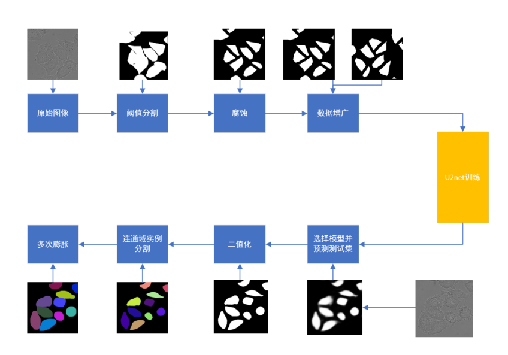

# Cell-Instance-Segmentation 模式识别与机器学习大作业(细胞分割)
> 姓名：高子靖
>
> 学号：2017010917
>
> 班级：自72
>
> Email: gaozj17@mails.tsinghua.edu.cn

本项目为2020年春季学期模式识别课程大作业，旨在完成分别在数据集一以及数据集二(少量标注)的细胞实例分割，并且以Jaccard相似度作为最终的评价指标。本人基于U-2-Net语义分割以及数字图形形态学预处理和后处理，完成了两数据集的实例分割，并提出了一种可处理细胞粘连的分割方法，具体代码基于U-2-Net进行修改与补充(https://doi.org/10.1016/j.patcog.2020.107404)

本方法在两测试集最终达到了平均jaccard相似度为0.835515和0.854498的效果。

<div align=center>

</div>  


-------
## 运行环境
- Windows 10 x64

## 库
- scikit-image == 0.16.2
- torchvision == 0.6.0
- pytorch == 1.5.0
- cudatoolkit == 10.1.243
- numpy == 1.18.1
- opencv == 3.4.2
- glob

## Set up  

```  
包的安装:
  
$ pip install -U numpy  
$ pip install opencv-python
$ pip install scikit-image
$ conda install pytorch torchvision cudatoolkit=10.1 -c pytorch
$ git clone https://github.com/ZjGaothu/Cell-Instance-Segmentation   
$ cd Cell-Instance-Segmentation 
```


## 目录结构
- data/:
    - dataset1/:
        - train/: uint16的训练集
        - test/: uint16的测试集
        - train_GT:/ 人工标注的训练集标签
    - dataset2/:
        - train_part/: 使用到的uint16的训练数据，来源于所有训练集的部分数据。
        - test/: uint16的测试集
        - train_GT/: 人工标注的训练集标签
- model/:
    - u2net.py: 训练模型
- saved_models/:
    - best_modeldata1.pth: 数据集一提交最高结果所使用的的模型参数。
    - best_modeldata2.pth: 数据集二提交最高结果所使用的的模型参数。
- test_data:/
    - best_modeldata1_results/: 数据集一保存的最优模型所预测出的概率，保存为三通道图像。
    - best_modeldata2_results/: 数据集二保存的最优模型所预测出的概率，保存为三通道图像。
- code/:
    - data_loder.py: 用于加载数据集
    - generate_data1/2.py: 用于生成能够输入网络中的训练集输入图像和监督标签图像。并完成了数据增强。
    - traindata1/2.py: 用于训练数据集一和数据集二的文件。
    - preddata1/2.py: 用于在训练集进行预测并保存结果至本地的测试集test文件。
    - handel1/2.py: 用于对数据集一和数据集二后处理的文件
    - my_implement_test:/(该部分并非复现结果的代码，仅将其重构后测试跑通)
        - train.py: 重构的训练集训练代码，运行需修改路径。
        - pred.py: 重构的测试集预测代码，运行需修改路径。
        - dataset.py: 重构的dataloader
- report.pdf：报告文档
